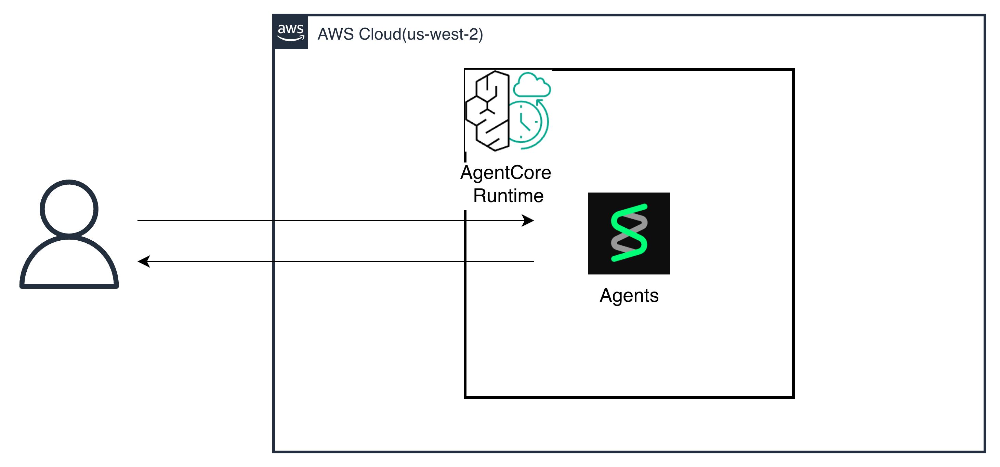

# AgentCore CDK テンプレート

AWS CDK を使って **Amazon Bedrock AgentCore Runtime** に Strands Agent をデプロイするテンプレートです。

---

## アーキテクチャ



---

## ディレクトリ構成

```
agentcore-cdk/
├── bin/
│   └── agentcore-cdk.ts       # CDKアプリのエントリポイント
├── lib/
│   └── agentcore-cdk-stack.ts # AWSリソースの定義（編集する場所）
├── agent/
│   ├── app.py                 # Strands Agentのコード（編集する場所）
│   ├── Dockerfile             # コンテナの設定
│   └── requirements.txt       # Pythonパッケージ
└── package.json
```

---

## 前提条件

- Node.js 18以上
- AWS CLI（認証済み）
- Docker

---

## セットアップ

### 1. 依存パッケージのインストール

```bash
npm install
```

### 2. CDKブートストラップ（初回のみ）

```bash
cdk bootstrap
```

### 3. デプロイ

```bash
cdk deploy
```

デプロイ完了後、ターミナルに以下が表示されます：

```
Outputs:
AgentcoreCdkStack.AgentRuntimeArn = arn:aws:bedrock-agentcore:us-west-2:XXXX:runtime/agentcore_cdk-XXXX
```

---

## リソース削除

```bash
cdk destroy
```
